### Hola todos 👋

- 😄 Soy FabianSato Ingeniero de Software. 
Trabajo actualmente en DEPT como ingeniero de software en AEM.

En estos repositorios junto con mi web y youtube trataré de subir mis trabajos y conocimiento en el desarrollo web.

Este es el repositorio de mi página principal desarrollada en bootstrap con todos mis trabajos y conocimiento.

# **Programación**
### 🐍 Python

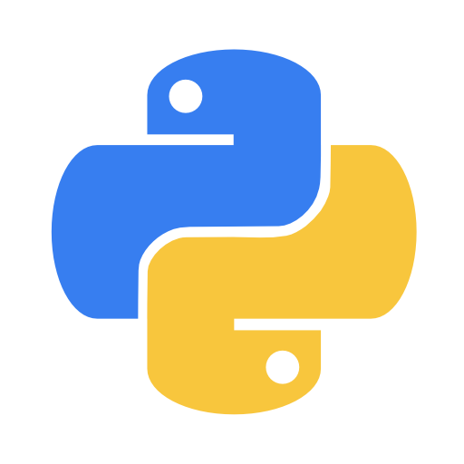

[Cheatsheet Python](https://github.com/fabiansato/python-cheatsheet "Cheatsheet Python por fabiansato")

[Ejercicios Python](https://github.com/fabiansato/Python-Ejercicios "Ejercicios Python por fabiansato")

### C

[Cheatsheet C](https://github.com/fabiansato/C-Cheatsheet "Cheatsheet C por fabiansato")

[Ejercicios C](https://github.com/fabiansato/c-ejercicios "Ejercicios C por fabiansato")

### C++
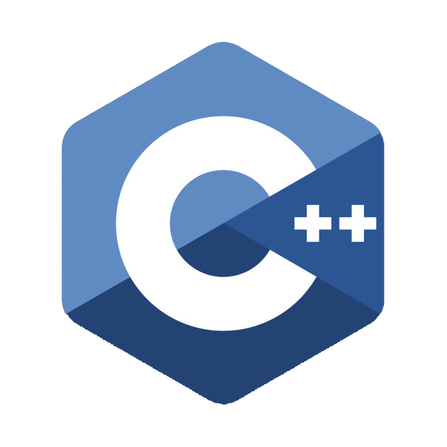

[Cheatsheet C++](https://github.com/fabiansato/cpp-cheatsheet "Cheatsheet C++ por fabiansato")

[Ejercicios C++](https://github.com/fabiansato/cpp-ejercicios "Ejercicios C++ por fabiansato")

### Java
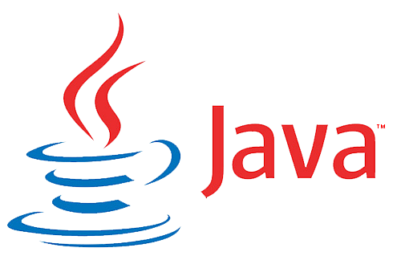

[Cheatsheet JAVA](https://github.com/fabiansato/java-cheatsheet "Cheatsheet JAVA por fabiansato")

[Ejercicios JAVA](https://github.com/fabiansato/java-ejercicios "Ejercicios JAVA por fabiansato")

### 💻 Javascript

[Cheatsheet Javascript](https://github.com/fabiansato/javascript-cheatsheet "Cheatsheet Javascript por fabiansato")

[Ejercicios Javascript](https://github.com/fabiansato/javascript-ejercicios "Ejercicios Javascript por fabiansato")

### 💻 PHP

[Cheatsheet PHP](https://github.com/fabiansato/php-cheatsheet "Cheatsheet PHP por fabiansato")

[Ejercicios PHP](https://github.com/fabiansato/php-ejercicios "Ejercicios PHP por fabiansato")

# **Programación web**

### 💻 HTML

[Cheatsheet HTML5](https://github.com/fabiansato/html5-cheatsheet "Cheatsheet de HTML5 por fabiansato")

[Ejercicios HTML5](https://github.com/fabiansato/javascript-ejercicios "Ejercicios de HTML5 por fabiansato")

[Codigos Utiles HTML5](https://github.com/fabiansato/html5-coolcodes "Códigos útiles de HTML5 por fabiansato")

(adicional)
HTML 5 con etiquetas semánticas:
[Etiquetas_semanticas_HTML5](https://github.com/fabiansato/html-etiquetas-semanticas "Html con etiquetas semanticas agregadas de HTML5 por fabiansato")
HTML 5 estructura web:
[Estructura_web_HTML5](https://github.com/fabiansato/html-estructuraweb "Estructura basica web para trabajar con HTML5 por fabiansato")

### 💻 CSS

#### BOOTSTRAP
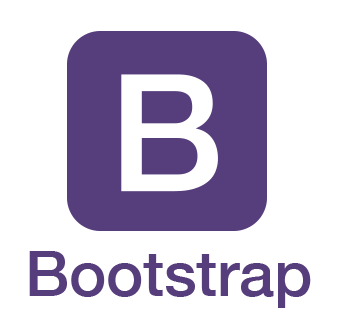

#### SASS

### REACTJS

[Cheatsheet ReactJS](https://github.com/fabiansato/reactjs-cheatsheet/ "Cheatsheet ReactJS por fabiansato")

[Ejercicios ReactJS](https://github.com/fabiansato/reactjs-ejercicios/ "Ejercicios ReactJS por fabiansato")

### Markdown

[Cheatsheet Markdown](https://github.com/fabiansato/Markdown-cheatsheet "Markdown Cheatsheet")

# **Programación web del lado del servidor**

### 💻 NodeJS
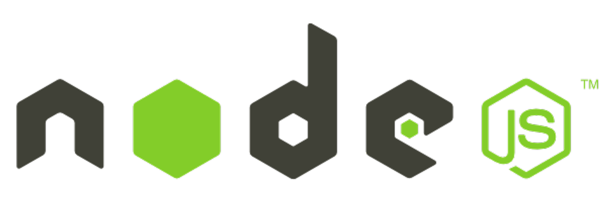

[Cheatsheet NodeJS](https://github.com/fabiansato/nodeJS-cheatsheet "Cheatsheet de NodeJS por FabianSato")

[Wiki NodeJS](https://github.com/fabiansato/nodeJS-cheatsheet/wiki "Wiki completo de NodeJS por FabianSato")

[Ejercicios de NodeJS](https://github.com/fabiansato/nodejs-ejercicios "Ejercicios NodeJS por FabianSato")

### 💻 Npm

### 💻 MYSQL
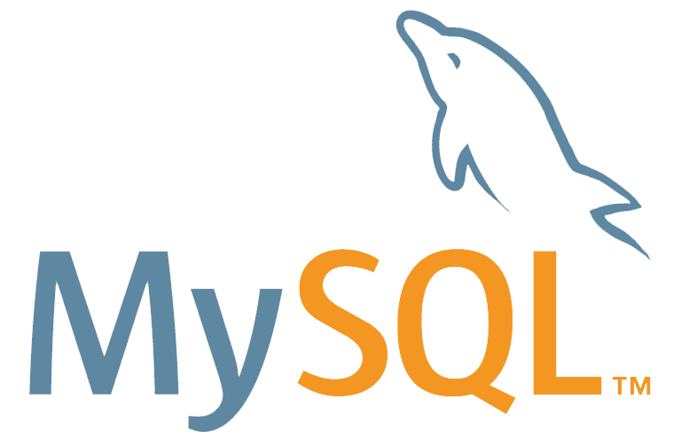

### 💻 PHPMYADMIN

## 💻 **TERMINAL**
### Terminal

[Cheatsheet Terminal Linux ](https://github.com/fabiansato/linux-terminal-cheatsheet/ "Cheatsheet Terminal Linux por fabiansato")

### Batch

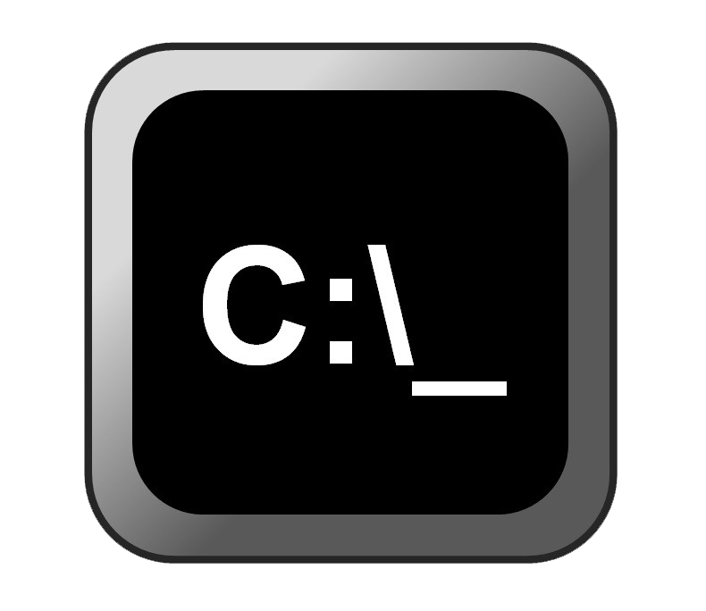

# **Modelos de programación**
## 💻 **Pseudocódigo**

## Pseint
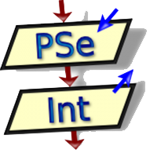

##Programacion Estructural

##Programacion orientada a objetos (POO)

##Programacion Modular

##Programacion asíncrona

# **Matematicas**
###Introduccion a la matematica

# **Electrónica**
###Arduino

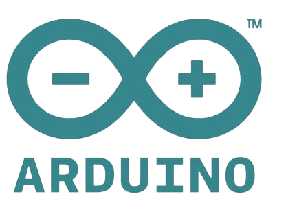

# **Gestores de versiones**
## GIT

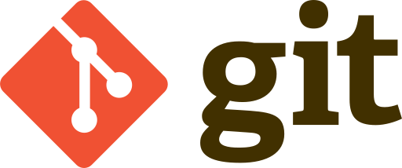

[Cheatsheet GIT](https://github.com/fabiansato/GIT-Cheatsheet "Cheatsheet GIT por fabiansato")

[Cheatsheet GIT](https://github.com/fabiansato/GIT-Cheatsheet "Cheatsheet GIT por fabiansat")

## GITHUB

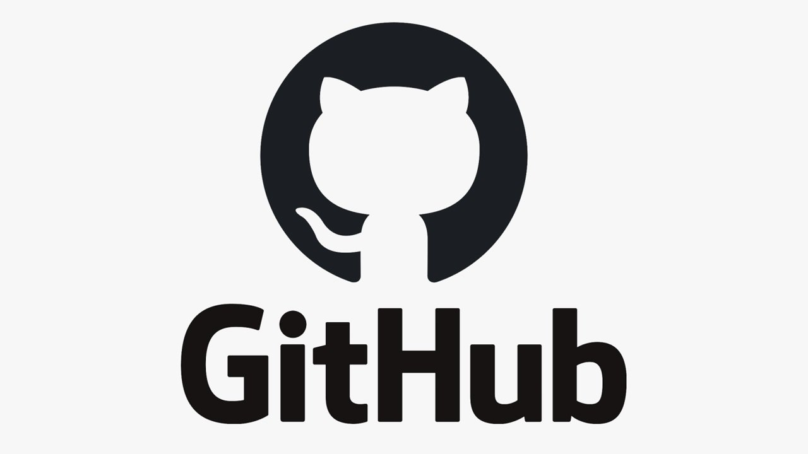

## BITBUCKET

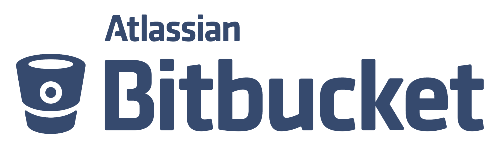
                                                                                              
# **Utilitarios**
### VSCODE
[Cheatsheet vscode](https://github.com/fabiansato/VScode-Cheatsheet "Cheatsheet VSCODE por fabiansato")

# **Diseño gráfico**
## Adobe Illustrator
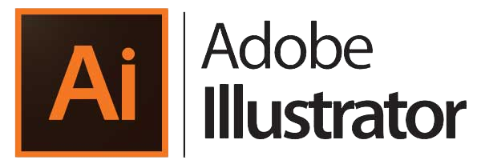

## Adobe Photoshop
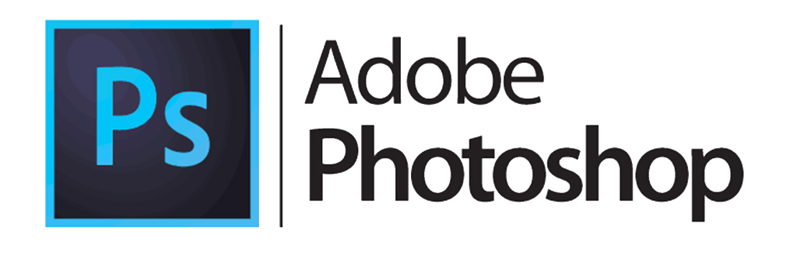

## **Un Carpincho para descontracturar**

La menera de estudiar y trabajar será la siguiente:
- 📓 Anotar cursos en one note ...
- 📖 Anotar curso + tareas en github ...
- 📝 Anotar Cheatsheet en github ...
- 📺 grabar curso para youtube ...
- 📰 actualizar webpage por FTP con este contenido () y. ...
- 📲 redes sociales con contenido nuevo. ...

 ✨ _Programación_ ✨ 
 - C Ejercicios 
 - C Cheatsheet 
 - Java Ejercicios 
 - Java cheatsheet 
 - Python Ejercicios
 - Python Cheatsheet
 -
